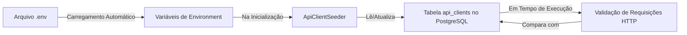

# 🌐 Fluxo Completo de Utilização de Variáveis de Ambiente no CrudIo.Api

Este documento explica detalhadamente como as variáveis de ambiente definidas no arquivo `.env` são consumidas, processadas e utilizadas ao longo da lifecycle da aplicação CrudIo.Api.

## 🔄 Visão Geral do Fluxo



## 🔐 Fluxo específico de Variáveis de Environment JWT

```mermaid
graph TD
    A[Arquivo .env] -->|Contém| B[JWT_SECRET<br/>JWT_ISSUER<br/>JWT_AUDIENCE<br/>JWT_EXPIRATION_MINUTES<br/>CLIENT_ACCESS_TOKEN_EXPIRATION_MINUTES<br/>CLIENT_REFRESH_TOKEN_EXPIRATION_DAYS]
    B -->|Carregamento na Inicialização| C[IConfiguration]
    C -->|Bind para| D[JwtSettings]
    D -->|Injeção de Dependência| E[JwtService]
    E -->|Utiliza para| F[Geração de Tokens JWT]
    E -->|Utiliza para| G[Validação de Tokens JWT]
    F -->|Retorna| H[Access Token<br/>(HMAC-SHA256)]
    F -->|Retorna também| I[Refresh Token<br/>(Aleatório + Hash BCrypt)]
    G -->|Valida| J[Assinatura<br/>Issuer<br/>Audience<br/>Expiration]
    J -->|Válido| K[Acesso Concedido]
    J -->|Inválido| L[401 Unauthorized]
```

## 📋 Etapas Detalhadas

### 1. **Carregamento das Variáveis (.env → Environment)**

ASP.NET Core possui suporte embutido para carregar variáveis de ambiente a partir de arquivos `.env` localizados na raiz do projeto.

**Arquivo:** `.env` (raiz do projeto)
```env
# Cliente API
CLIENT_ID=crudio-client
CLIENT_API_KEY="&,M:8<bi|5=NmnG&P?dJ=ibriyx|6bG|V/r+p-D&#c:p84N)=2"
CLIENT_NAME=CrudIo Integration

# Postgres
POSTGRES_HOST=localhost
POSTGRES_PORT=5432
POSTGRES_DB=appdb
POSTGRES_USER=appuser
POSTGRES_PASSWORD=appuser

# MongoDB
MONGO_ROOT_USERNAME=appuser
MONGO_ROOT_PASSWORD=appuser

# Redis
REDIS_PASSWORD=appuser

# JWT
JWT_SECRET="6Y59~2+(]G4!r/k_;1*<p;1u^Q>U=wXn5m3V}F1k9?-D&,C+^$\j_9c7R9r[/Q^XC6U^:hDJ"
JWT_ISSUER=CrudIo.Api
JWT_AUDIENCE=CrudIo.Client
JWT_EXPIRATION_MINUTES=3600
CLIENT_ACCESS_TOKEN_EXPIRATION_MINUTES=15
CLIENT_REFRESH_TOKEN_EXPIRATION_DAYS=30
```

**Como é carregado:**
- Ao iniciar a aplicação (`dotnet run`), o host ASP.NET Core procura automaticamente por arquivos `.env` no diretório raiz
- As variáveis são carregadas na coleção `Environment.GetEnvironmentVariable()`
- Este processo ocorre **antes** da execução de qualquer código de aplicação

> 💡 **Observação:** Variáveis de ambiente definidas no sistema operacional têm precedência sobre as do arquivo `.env`.

### 2. **Processamento na Inicialização (Environment → Database)**

Durante a inicialização da aplicação (em `Program.cs`), ocorre o **seeding** dos clientes API a partir das variáveis de ambiente.

**Arquivo:** `src/Program.cs` (linhas 119-124)
```csharp
using (var scope = app.Services.CreateScope())
{
    var dbContext = scope.ServiceProvider.GetRequiredService<AppDbContext>();
    await dbContext.Database.MigrateAsync();
    await ApiClientSeeder.SeedFromEnvironmentAsync(scope.ServiceProvider); // ← CHAVE
}
```

**Arquivo:** `src/CrudIo.Api/Common/Security/ApiClientSeeder.cs`

```csharp
public static async Task SeedFromEnvironmentAsync(IServiceProvider serviceProvider)
{
    // 1️⃣ LEITURA DAS VARIÁVEIS DE AMBIENTE
    var clientId = Environment.GetEnvironmentVariable("CLIENT_ID");
    var apiKey = Environment.GetEnvironmentVariable("CLIENT_API_KEY");
    var name = Environment.GetEnvironmentVariable("CLIENT_NAME") ?? "Default API Client";

    // Validação básica
    if (string.IsNullOrWhiteSpace(clientId) || string.IsNullOrWhiteSpace(apiKey))
        return; // Skip se não configurado

    var dbContext = serviceProvider.GetRequiredService<AppDbContext>();
    var passwordService = serviceProvider.GetRequiredService<IPasswordService>();

    // 2️⃣ BUSCA/ATUALIZAÇÃO NO BANCO DE DADOS
    var apiClient = await dbContext.ApiClients
        .FirstOrDefaultAsync(x => x.ClientId == clientId);

    if (apiClient is null)
    {
        // CRIA NOVO REGISTRO (primeira inicialização)
        apiClient = new ApiClient
        {
            Id = Guid.NewGuid(),
            ClientId = clientId,                                    // ← Direto do .env
            ApiKeyHash = passwordService.Hash(apiKey),              // ← Hash da chave do .env
            Name = name,
            IsActive = true,
            CreatedAt = DateTime.UtcNow
        };

        dbContext.ApiClients.Add(apiClient);
    }
    else
    {
        // ATUALIZA REGISTRO EXISTENTE (reinicializações subsequentes)
        apiClient.ApiKeyHash = passwordService.Hash(apiKey);        // ← Atualiza hash se changed
        apiClient.Name = name;
        apiClient.IsActive = true;
        apiClient.RevokedAt = null;                                 // ← Reativa se foi revogado
        apiClient.UpdatedAt = DateTime.UtcNow;
    }

    // 3️⃣ PERSISTÊNCIA NO BANCO
    await dbContext.SaveChangesAsync();
}
```

**O que acontece na tabela `api_clients` (mapeamento Entity Framework):**
| Propriedade C# | Valor | Origem |
|----------------|-------|--------|
| `Id` | UUID gerado | Application |
| `ClientId` | `crudio-client` | Direto de `CLIENT_ID` (.env) |
| `ApiKeyHash` | Hash BCrypt de `",&M:8<bi|5=NmnG&P?dJ=ibriyx|6bG|V/r+p-D&#c:p84N)=2"` | Derivado de `CLIENT_API_KEY` (.env) |
| `Name` | `CrudIo Integration` | Direto de `CLIENT_NAME` (.env) |
| `IsActive` | `true` | Valor fixo no seeder |
| `CreatedAt` | Timestamp | Application |
| `UpdatedAt` | Timestamp | Application (atualizado a cada seed) |
| `RevokedAt` | `NULL` | Valor fixo no seeder |

### 3. **Validação em Tempo de Execução (Requête → Environment Indireto)**

Quando uma requisição chega ao endpoint de autenticação de cliente, as variáveis de ambiente **não são lidas diretamente**. Em vez disso, ocorre uma validação contra o banco de dados populado durante o seeding.

**Endpoint:** `POST /auth/client-token`  
**Arquivo:** `src/CrudIo.Api/Features/Auth/AuthEndpoints.cs`
```csharp
group.MapPost("/client-token", async (
    HttpContext context,
    ISender sender,
    [FromHeader(Name = "client-id")] string clientId,           // ← DO HEADER HTTP
    [FromHeader(Name = "client-api-key")] string clientApiKey)  // ← DO HEADER HTTP
{
    var result = await sender.Send(new ClientTokenCommand(clientId, clientApiKey));
    return Results.Ok(result);
});
```

**Arquivo:** `src/CrudIo.Api/Features/Auth/ClientToken/ClientTokenCommandHandler.cs`
```csharp
public async Task<ClientTokenResponse> Handle(
    ClientTokenCommand request,
    CancellationToken cancellationToken)
{
    // Validação básica de entrada
    if (string.IsNullOrWhiteSpace(request.ClientId) ||
        string.IsNullOrWhiteSpace(request.ClientApiKey))
    {
        throw new UnauthorizedAccessException("Invalid client credentials.");
    }

    // 1️⃣ BUSCA NO BANCO DE DADOS (não lê .env diretamente!)
    var apiClient = await _dbContext.ApiClients
        .FirstOrDefaultAsync(x =>
            x.ClientId == request.ClientId &&  // ← Compara com ClientId DO BANCO (que veio do .env na seed)
            x.IsActive &&
            x.RevokedAt == null,
            cancellationToken)
        ?? throw new UnauthorizedAccessException("Invalid client credentials.");

    // 2️⃣ VERIFICAÇÃO DE CREDENCIAL
    var isApiKeyValid = _passwordService.Verify(
        request.ClientApiKey,              // ← Valor DO HEADER HTTP da requisição atual
        apiClient.ApiKeyHash);             // ← Hash DO BANCO (originalmente do .env na seed)

    if (!isApiKeyValid)
        throw new UnauthorizedAccessException("Invalid client credentials.");

    // ... resto do processo (geração de tokens, etc.)
}
```

## 🔐 **Benefícios de Segurança desta Abordagem**

1. **Nunca expoe credenciais em tempo de execução**
   - A chave de API do `.env` é usada **apenas uma vez** durante o seeding
   - Em memória/runtime, só existe o **hash** da chave (nunca a chave em texto plano)
   - Mesmo com acesso total à aplicação em produção, um atacante não pode recuperar a chave original

2. **Proteção contra vazamento acidental**
   - Se alguém der `dump` na memória da aplicação ou nos logs, verá apenas hashes
   - As variáveis de ambiente sensíveis existem apenas no contexto do sistema operacional durante o boot

3. **Suporte a rotação segura de credenciais**
   - Para atualizar credenciais: modifique o `.env` e reinicie a aplicação
   - O seeder atualizará o hash no banco de dados na próxima inicialização
   - Clientes usando tokens antigos terão seus access tokens revogados naturalmente na expiração

4. **Isolamento de ambientes**
   - Diferentes `.env` para desenvolvimento, staging e produção
   - Cada ambiente tem seu próprio registro isolado na tabela `api_clients`

## 🛠️ **Como Atualizar/Modificar Credenciais**

### Método Recomendado (Atualização Segura)
1. Edite o arquivo `.env` na raiz do projeto:
   ```env
   # Alterar estes valores
   CLIENT_ID=novo-cliente-id
   CLIENT_API_KEY="nova-chave-secreta-aqui"
   ```
2. Reinicie a aplicação:
   ```bash
   # Se rodando via docker-compose
   docker compose restart api
   
   # Ou se rodando diretamente com dotnet
   pkill -f dotnet  # Para processos existentes
   dotnet run --project src/src.csproj
   ```
3. O `ApiClientSeeder` detectará a mudança e atualizará o registro no banco de dados

### Método Alternativo (Atualização Direta no Banco)
```sql
-- Conectar ao PostgreSQL
psql -h localhost -U appuser -d appdb

-- Atualizar credenciais
UPDATE api_clients SET
    client_id = 'novo-cliente-id',
    api_key_hash = crypt('nova-chave-secreta-aqui', gen_salt('bf')),
    updated_at = NOW(),
    revoked_at = NULL  -- Reativa se estava revogado
WHERE client_id = 'antigo-cliente-id';
```

## 🧪 **Como Testar as Credenciais**

Use exatamente os valores definidos no seu `.env` nos headers HTTP:

```bash
# Substitua pelos valores do SEU .env
export CLIENT_ID="crudio-client"
export CLIENT_API_KEY='",&M:8<bi|5=NmnG&P?dJ=ibriyx|6bG|V/r+p-D&#c:p84N)=2'

# Teste o endpoint de client token
curl -v -X POST http://localhost:5051/auth/client-token \
  -H "client-id: $CLIENT_ID" \
  -H "client-api-key: $CLIENT_API_KEY"
```

**Resposta esperada (200 OK):**
```json
{
  "accessToken": "eyJhbGciOiJIUzI1NiIsInR5cCI6IkpXVCJ9...",
  "refreshToken": "zOGphOwIQCWHYf28wrmSyzhlfqOGvdQ8i2kyu_3p20qJIRy8tstgwi0skMwSyL_tby1nz8BTNkW9pfPFWXe4AQ",
  "tokenType": "Bearer",
  "expiresIn": 900,
  "expiresAt": "2026-06-19T21:40:57.7236368Z",
  "refreshExpiresAt": "2026-07-19T21:25:57.6614545Z"
}
```

## 🚨 **Solução de Problemas Comuns**

### Problema: `401 Unauthorized` no endpoint `/auth/client-token`
**Causas possíveis:**
1. **Credenciais incorretas nos headers**  
   → Verifique se está usando exatamente os valores do `.env`
   
2. **Seeder não executou ou falhou**  
   → Verifique os logs de inicialização para mensagens do `ApiClientSeeder`
   
3. **Registro não existe no banco**  
   → Execute: `SELECT * FROM api_clients WHERE client_id = 'seu-client-id';`
   
4. **Registro revogado ou inativo**  
   → Verifique os campos `is_active = true` e `revoked_at IS NULL`

### Problema: Alterações no .env não são refletidas
**Causas possíveis:**
1. **Aplicação não foi reiniciada**  
   → O seeder só roda na inicialização
   
2. **Variáveis de ambiente do SO têm precedência**  
   → Verifique se não há variáveis com mesmo nome definidas no sistema
   
3. **Falha silenciosa no seeder**  
   → Adicione logging temporário ao `ApiClientSeeder.SeedFromEnvironmentAsync`

### Problema: `500 Internal Server Error` durante seeding
**Causas possíveis:**
1. **Falha de conexão com PostgreSQL**  
   → Verifique se o serviço postgres está saudável: `docker compose ps postgres`
   
2. **Migrações pendentes**  
   → O seeding ocorre efter `dbContext.Database.MigrateAsync()`
   
3. **Falha no hash de senha**  
   → Verifique se o `IPasswordService` está funcionando corretamente

## 📂 **Referências de Código Diretas**

- **Carregamento de .env:** Infraestrutura nativa do ASP.NET Core Host Builder
- **Leitura de Environment:** `Environment.GetEnvironmentVariable("VAR_NAME")`
- **Seeder de Clientes API:** `src/CrudIo.Api/Common/Security/ApiClientSeeder.cs`
- **Endpoint de Client Token:** `src/CrudIo.Api/Features/Auth/AuthEndpoints.cs`
- **Handler de Client Token:** `src/CrudIo.Api/Features/Auth/ClientToken/ClientTokenCommandHandler.cs`
- **Serviço de Senha (Hash/Verify):** `src/CrudIo.Api/Common/Security/PasswordService.cs`
- **Entidade ApiClient:** `src/CrudIo.Api/Data/Entities/ApiClient.cs`
- **Tabela api_clients no Banco:** Gerado pelas migrações em `src/Migrations/`

## ✅ **Resumo para Desenvolvedores**

> **"As variáveis de ambiente do .env são sementes, não fontes diretas."**
> 
> 1. 🌱 **Semente:** Variáveis definidas uma vez no `.env`
> 2. 🌱 **Germinação:** Durante inicialização, o `ApiClientSeeder` planta essas sementes no banco de dados (como hashes seguros)
> 3. 🌳 **Árvore em Tempo de Execução:** Todas as requisições validam contra o banco de dados (a árvore成熟), não contra o .envOriginal
> 4. ♻️ **Rebrota:** Para mudar as credenciais, plante novas sementes (atualize .env + reinicie) e deixe a árvore crescer novamente

Este padrão proporciona:
- ✅ **Segurança:** Credenciais nunca expostas em texto plano após o boot
- ✅ **Flexibilidade:** Possibilidade de atualização sem redeploy de código
- ✅ **Auditabilidade:** Histórico de mudanças no banco de dados (via `updated_at`)
- ✅ **Escalabilidade:** Suporta múltiplos clientes API com credenciais independentes

---
*Documento gerado em: 20 de junho de 2026*  
*Baseado na análise funcional do CrudIo.Api versão .NET 10*  
*Local: `/mnt/02 - OWD/.owd/.oct/.pus/.wd/.files/03 - Projetos/02 - Clients/01 - CRUD.io/01 DOTnet8/docs/environments.md`*